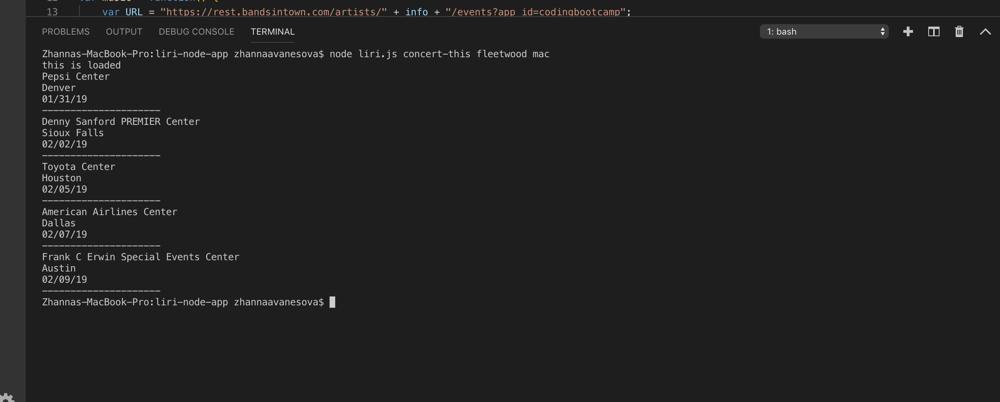

# Liri Node App

## Purpose
* This app allows users to retrieve the following information:
  * An artist's next five concerts, including: the venue name, city, and time of the event.
  * Information about a song, including: artist, album, and a Spotify link to the song.
  * Information about a movie, including: release date, ratings, country, language, plot, and actors.

## Technologies Used
* This app was built with:
  * Javascript
  * Node
  * Spotify API
  * Bands In Town API 
  * OMDB API
  * Axios
  * Moment.js
 
## How It Works
* This app takes in four commands:
  * The following command retreives concert information for an artist the user inputs:
   * node liri.js concert-this <artist name here>
   * https://github.com/zavanesova/liri-node-app/blob/master/screenshots/concert.png?raw=true
   * 
   * 
      
  

